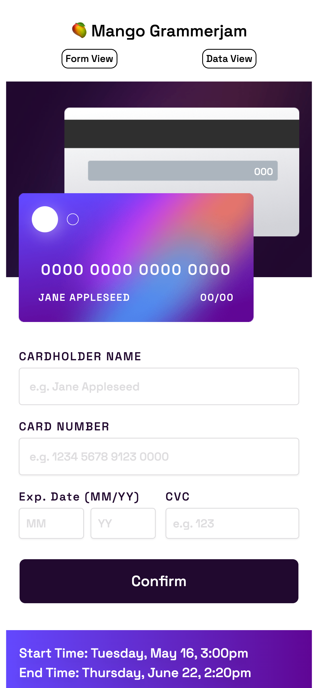

[![alex-linkedin-shield]][alex-linkedin-url]
[![steve-linkedin-shield]][steve-linkedin-url]

<div align="center">
<a href="https://github.com/Mango-Entertainment/project3C">
    
  </a>

  <h3 align="center">Project 3C</h3>

   <p align="center">
    Bienvenue! 
    <br />
    <a href="https://main--mango-grammerjam-p3c.netlify.app/">View Project 3C</a>
    ·
    <a href="https://github.com/Mango-Entertainment/project3C/issues/new">Report Bug</a>
  </p>
</div>

## About Project 3C

Project 3C has a form for adding in your card information and a data view. The data view shows the saved data entered into the app from the database.

### Built With

[![MongoDB][Mongodb]][Mongo-url][![Express][Expressjs]][Express-url][![React][React.js]][React-url][![Node][Node.js]][Node-url]

[![Tailwind][Tailwindcss]][Tailwind-url]

[![Netlify][NETLIFY]][Netlify-url]

[![Vite]][Vite-url]


## Local Project Setup

You need a MongoDB instance to persist the data.

Run `npm install` in your terminal.

### Environment Variable Setup

Run this command in your terminal to create a .env:

```bash
cd server
touch .env
```

Open up the `.env` your just made and add these variables:

```
DB_CONNECT=<YOUR_MONGO_CONNECTION_STRING>
PORT=3000
```

Running `npm run dev` in your terminal will run both the front and backend concurrently.


[alex-linkedin-shield]: https://img.shields.io/badge/-Alex's_LinkedIn-black.svg?style=for-the-badge&logo=linkedin&colorB=555
[alex-linkedin-url]: https://www.linkedin.com/in/alexcurtisslep/
[steve-linkedin-url]: https://www.linkedin.com/in/stevesmodish/
[steve-linkedin-shield]: https://img.shields.io/badge/-Steve's_LinkedIn-black.svg?style=for-the-badge&logo=linkedin&colorB=555
[React.js]: https://img.shields.io/badge/React-20232A?style=for-the-badge&logo=react&logoColor=61DAFB
[React-url]: https://reactjs.org/
[Tailwindcss]: https://img.shields.io/badge/Tailwind_CSS-38B2AC?style=for-the-badge&logo=tailwind-css&logoColor=white
[Tailwind-url]: https://tailwindcss.com/
[Mongo-url]: https://www.mongodb.com/
[Mongodb]: https://img.shields.io/badge/MongoDB-4EA94B?style=for-the-badge&logo=mongodb&logoColor=white
[Express-url]: https://expressjs.com/
[Expressjs]: https://img.shields.io/badge/Express.js-404D59?style=for-the-badge
[Node-url]: https://nodejs.org/en
[Node.js]: https://img.shields.io/badge/Node.js-43853D?style=for-the-badge&logo=node.js&logoColor=white
[Netlify-url]: https://www.netlify.com/
[NETLIFY]: https://img.shields.io/badge/Netlify-00C7B7?style=for-the-badge&logo=netlify&logoColor=white
[Vite-url]: https://vitejs.dev/
[Vite]: https://img.shields.io/badge/Vite-B73BFE?style=for-the-badge&logo=vite&logoColor=FFD62E
